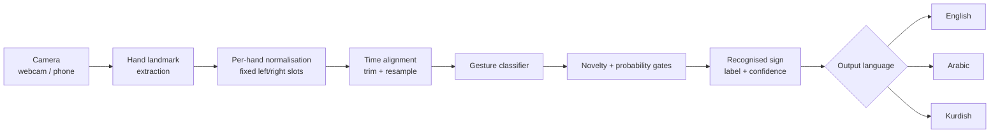

# DESTDENG


**▶ [mahmoudyouns22.github.io/destdeng](https://mahmoudyouns22.github.io/destdeng/)** — nothing installed, nothing uploaded. The **word board** works the moment it opens; sign recognition works once it has been taught.

**A camera-based sign language recognition system for the Kurdistan Region — turning signs into text, in the language the reader needs.**

*"Destdeng" — from Kurdish **dest** (hand) and **deng** (voice): giving the hand a voice.*

> **Status:** Working end to end on a small vocabulary. Record signs, train, recognise.

---

## The Problem

There are roughly **10,000 deaf people in the Kurdistan Region of Iraq**. As of 2024, there were **five working sign language interpreters** for all of them.

That ratio is the whole problem. It means a deaf person in Erbil who needs to see a doctor, sign a document at a notary office, report something at a police station, or sit an exam usually does it **without an interpreter** — because there is no interpreter to have. Nationally the picture is the same shape: Iraq has over 272,000 deaf citizens and fewer than 100 interpreters, none of them stationed in hospitals or courts. Iraqi Law No. 11 of 2024 guarantees the right to an interpreter. The people to deliver that right do not exist in sufficient numbers.

Three things make this harder than it looks from outside:

1. **Kurdish Sign Language (ZHK) is its own language.** It is *not* mutually intelligible with Iraqi Sign Language, and it is not a signed form of spoken Kurdish. An interpreter trained in Baghdad cannot understand a deaf Kurd from Sulaymaniyah.
2. **It has regional dialects** — Erbil, Sulaymaniyah, and Duhok each developed around their own deaf school, with real lexical differences between them.
3. **Almost no machine learning work exists for it.** The large public sign language datasets are ASL, BSL, and to a lesser extent Arabic Sign Language. For ZHK there is essentially nothing to download. Formal teaching of it only began at university level in 2024.

So the gap is not "another sign language app." Every off-the-shelf sign recognition model in existence is trained on a language the people here do not sign.

## What DESTDENG Does

DESTDENG reads sign gestures from an ordinary webcam or phone camera, recognises them, and renders the meaning as text — with the **output language selected by the reader**: English, Arabic, or Kurdish.

That last part is the design decision that matters. The deaf signer and the person they need to communicate with rarely share a written language either: a deaf Kurdish signer at a hospital may face a doctor who reads Arabic, an NGO worker who reads English, and a clerk who reads Kurdish. One recognition system, three possible outputs, chosen at the moment of use.

**Intended use:** a laptop or phone on a desk between two people — one signing, one reading. No specialised hardware, no gloves, no depth camera, no internet connection required.

## How It Works



**1. Capture.** Standard camera frames, no special equipment.

**2. Landmark extraction.** Rather than feeding raw pixels to a network, the system extracts 21 hand keypoints per hand, per frame. This is what makes the project feasible on a normal CPU laptop: the model never has to learn "what a hand looks like" from scratch, and it stays robust to skin tone, lighting, clothing, and background — all of which vary enormously in real deployment and none of which carry meaning in sign language.

> **Hands only, for now.** V1 tracks hands and not the upper body. Sign languages place meaning in *where* a sign is made relative to the body as well as in the handshape, so this is a real ceiling on what the current vocabulary can grow into, not a detail. Body pose is on the roadmap below; it is listed as a limitation here rather than glossed over, because the accuracy it costs is easy to mistake for a modelling problem.

**3. Feature construction.** Three things happen here, and each removes a difference that is not the sign ([`src/features.py`](src/features.py)):

- **Per-hand normalisation.** Each hand is translated to put its wrist at the origin and scaled by its own span, so a tall person far from the lens and a child close to it produce comparable features.
- **Fixed hand slots.** MediaPipe returns detected hands in no guaranteed order, so a hand is placed by its *handedness*, never by the order it arrived in. Without this, a two-handed sign looks like two different signs whenever the detector reorders them mid-recording.
- **Time alignment.** Empty frames before and after the sign are trimmed and what remains is resampled to a fixed length. A sign started half a second late fills a different part of the window, and a flattened window is position-sensitive — so without this, *when* you started signing registers as *what* you signed.

**4. Classification.** A Random Forest maps the aligned keypoint sequence, plus per-keypoint movement totals, to a sign label with a probability.

**5. Output.** The recognised label is mapped to its written form in the reader's chosen language. Because the classifier outputs a language-neutral *label*, adding an output language is a data-entry task, not a retraining task.

> **Kurdish means Sorani in Arabic script.** The reader this is built for is in Erbil, Sulaymaniyah or Duhok, and the written Kurdish they read is Sorani — سڵاو, not *Slaw*. Kurmanji in Latin script is the standard in Turkey and Syria; printing it to a Kurdish reader in a clinic in Erbil hands them a transliteration of their own language. The Latin form is kept alongside as `ku_latin`, for anyone who needs it and as a fallback when no Arabic-capable font is installed.

### Design principle: never guess silently

A wrong translation in a hospital is worse than no translation. **The metric that matters is not top-1 accuracy; it is how rarely the system asserts something false with confidence.**

Getting that right took two attempts, and the first one is worth describing because it is a trap.

The obvious approach is to read the classifier's probability and refuse below a threshold. **That does not work.** A Random Forest handed input unlike anything it was trained on still routes it down its trees and can emerge completely certain. Feeding the trained model pure noise produced a **100% confident** answer for a sign nobody made.

So recognition passes through two independent gates (`src/confidence.py`):

| Gate | Question | Catches |
|---|---|---|
| **Novelty** | Is this anything like the data we trained on? Measured as distance to the nearest training sample. | "That wasn't a sign at all" |
| **Probability** | Given it *is* familiar input, is the classifier sure *which* sign? | "That was a sign, but I can't tell which" |

A sample must pass both. They fail in different ways, which is why one alone is not enough. Measured against a trained model: noise, half-scale input and an empty frame are all refused; genuine samples pass at 99%. Those four cases are asserted in the self-test, so the guarantee cannot rot silently.

Two details decide whether the novelty gate is real or decorative:

- **Distance is measured in a reduced space, not on the raw 3,907 features.** In a space that wide every point sits at roughly the same distance from every other, so "nearest neighbour" stops discriminating and the gate quietly waves everything through.
- **The threshold is a quantile, not the maximum.** Keying it to the single most isolated training sample lets one bad recording inflate the limit far enough to admit anything — the gate would still be there, and it would still be useless. The self-test injects exactly that outlier and fails if the limit moves much.

### The refusal must not read as a sign

`Please repeat` is itself a sign in the vocabulary — a deaf person can ask the other party to repeat themselves. So the failure message cannot also be "Please repeat": the reader would have no way to tell *the deaf person asked you to repeat* from *the machine failed*, which is precisely the confident falsehood this project exists to avoid. System messages live in their own table in [`src/vocabulary.py`](src/vocabulary.py), can never be predicted as a label, and say who did not understand.

### The part that works before anything is taught

Recognition needs a trained model, and there is no public dataset for Kurdish Sign
Language to build one from — that absence is the whole premise of this project, not a
gap in it. A recognition system with no data recognises nothing, and a page that
recognises nothing helps nobody standing at a desk today.

So the site does not lead with the thing that needs data. It also carries a **word
board**: every sign in the vocabulary as a card, tapped to fill the screen, with the
other two languages underneath. Tap `نەخۆشخانە`, turn the screen around, and the
doctor reads *Hospital* or *مستشفى* without anyone changing a setting.

This is not a placeholder for the real feature. It addresses the same problem the
project exists for — a deaf person and a clerk who read different scripts, with no
interpreter in the building — and it is what people already improvise with pen and
paper. The difference is that the writer does not have to know the reader's script.
It needs no camera, no teaching, and no model.

The system messages are deliberately absent from it. "I did not understand" is
something the *system* says about itself, and a person tapping it would be saying
something they did not mean — the same separation `src/vocabulary.py` keeps, for the
same reason.

### The interface is part of the guarantee

The person reading this screen is usually a stranger to it — a doctor, a clerk, an
officer — with a deaf person waiting in front of them. They get one glance to find the
answer and to judge whether the machine is sure. So the interface carries the same rule
as the classifier, and `src/theme.py` holds the palette, panels, chips and meters that
every camera screen is built from, instead of each screen drawing its own.

- **Accepted and refused never share a colour.** A recognised sign is white on a teal
  rule; a refusal is amber on an amber rule, and the confidence meter is withheld
  rather than shown low — a short bar next to a refusal invites the reader to treat a
  rejected guess as a weak answer, which is exactly the reading the project exists to
  prevent. That distinction survives not being able to read the script the message is
  written in.
- **Nothing is positioned by a magic number.** Every element is placed from the frame's
  real width and height, so the layout holds from a 640×480 webcam to 1080p and on a
  phone held in portrait. The countdown used to be drawn at a fixed `(280, 260)`, which
  is centred on exactly one camera resolution.
- **Long output shrinks to fit.** A recognised sign is one short word; a refusal is a
  whole sentence, and the Kurdish one is the longest string the panel ever shows.
  Overflowing an RTL line cuts it off at the *left* edge — the end of the sentence — so
  the reader sees a message that looks complete and is not.
- **The output follows the language, not the moment it was read.** The result is kept
  as a label rather than as rendered text, so pressing `2` after a sign has been read
  re-renders it in Arabic. At a hospital desk the person pressing the key is often not
  the person who has to read the word.
- **The state the signer can act on is the state on screen.** "No hands in frame" is
  the most common reason a capture fails and the one thing they can fix before pressing
  SPACE, so it is in the top bar rather than discovered after a failed reading.
- **The menu knows what you have not done yet.** It reads `data/` and `models/` each
  time it draws, dims the steps that cannot work, and names the next one worth doing —
  because choosing "recognise" before "train" otherwise produces a missing-file error
  that reads like a broken install rather than a skipped step. It degrades to plain
  ASCII when the terminal has no colour, and honours `NO_COLOR`.

### The Kurdish that renders is not the Kurdish you typed

Pillow cannot shape Arabic script by itself, so the text is reshaped first and the
letters' joined forms are what reach the font. That indirection hides a trap worth
naming, because it produced broken Kurdish while every check in the project passed.

`arabic-reshaper` has a Kurdish mode, and switching it on looks obviously correct.
It is not: **ە ڵ ێ have no Unicode presentation forms at all**, so the library emits
*private-use* codepoints for them — slots that are empty in every ordinary font.
Tahoma, Segoe UI and Arial all draw them as hollow boxes. سڵاو came out perfectly and
تێنەگەیشتم came out as `ت□نە□گە□یشتم`: the message shown when the system has **not**
understood, rendered unreadably, for the reader least able to check it.

A font-coverage check was already in place and did not catch it, for a reason that
generalises past this bug: **it tested the raw letters.** Every candidate font
contains all 42 characters the vocabulary uses. What the font is asked for is the
reshaper's *output*, and nothing was testing that.

So the font and the shaping mode are now chosen together, by rendering a probe built
from the real vocabulary and comparing pixels — Kurdish mode if some font can draw its
private-use slots, the standard mode otherwise, unshaped before boxes, and the choice
is named in the startup line rather than assumed. Install a Kurdish font that fills
those slots, add it to `FONT_CANDIDATES`, and the better typography is picked up with
no other change. The self-test asserts that nothing on screen is undrawable, so this
cannot come back quietly.

## Running it

```
pip install -r requirements.txt
python main.py
```

`main.py` is a menu over the whole pipeline, so nothing has to be memorised:

| | |
|---|---|
| **1 Camera test** | Webcam opens, hand skeletons drawn live, FPS counter. Proves the vision layer works. |
| **2 Record samples** | Press SPACE, countdown, make the sign. ~30 samples per sign. |
| **3 Train** | Seconds on a CPU. Prints the score, then explains why that score is optimistic. |
| **4 Recognise** | The system itself. SPACE reads a sign; 1/2/3 switch the output language. |
| **5 Vocabulary** | The signs it knows, in all three languages. |
| **6 Self-test** | The checks below. No camera, no MediaPipe, no OpenCV needed. |

```
python tests/test_pipeline.py
```

Eleven checks over normalisation, hand-slot stability, time alignment, both refusal gates, the vocabulary and the text rendering — almost all on synthetic data, so the pipeline stays verifiable on a machine that cannot install the vision stack at all. Ten of them need only numpy and scikit-learn; the eleventh needs a font to inspect and reports itself as `skip` rather than passing quietly when there is none.

Full instructions and troubleshooting: [`SETUP.md`](SETUP.md).

### What is in this repository

| File | What it does |
|---|---|
| `src/features.py` | Normalisation, handedness slots, time alignment — the feature pipeline. Pure NumPy, so it stays testable without a camera |
| `src/landmarks.py` | The camera test: live keypoint extraction with frame rate and hand-slot readout |
| `src/record_dataset.py` | Records labelled samples into `data/<label>/` |
| `src/train_model.py` | Trains the classifier and fits the novelty check |
| `src/confidence.py` | Decides when **not** to answer — the two gates described above |
| `src/recognise.py` | The live system: camera in, text out, language selectable |
| `src/vocabulary.py` | Label → English / Arabic / Kurdish. The only file that knows about words |
| `src/text_render.py` | Draws Arabic and Kurdish on the video frame (OpenCV cannot), joined and right-aligned. Picks the font and the shaping mode by testing what this machine can actually draw |
| `src/theme.py` | The palette, panels, pills and meters every camera screen is built from — one visual language instead of three |
| `src/console.py` | Lets the terminal print Arabic and Kurdish instead of crashing on them |
| `tests/test_pipeline.py` | The self-test — everything that does not need a camera |
| `src/mp_compat.py` | Fails with a useful message if MediaPipe is the wrong version |
| `web/` | The browser build: same pipeline, same refusal, no Python and no button |
| `web/js/segment.js` | Decides when a sign starts and stops, so nothing has to be pressed |
| `web/js/bundle.js` | Reads and writes the signs file, so a taught session survives the browser |
| `web/model/` | Where a recorded signs file goes to ship with the site. Empty on purpose — see its README |
| `tools/check_parity.py` | Runs both feature pipelines on the same inputs and fails on any difference |
| `tools/test_web.mjs` | The web build's own 17 checks — its gates are asserted, not assumed |

`data/` and `models/` are both gitignored, and the second matters more than it looks: the novelty check carries a compressed projection of the training set inside the model file, so excluding `data/` while publishing `models/` would hand over the recordings anyway.

## What this version fixed

Each of these was found by running the thing rather than by reading it, and each was
silent — the program reported success in every case.

| Fixed | Why it mattered |
|---|---|
| Kurdish shaping emitted **private-use codepoints** for ە ڵ ێ, which no ordinary font contains | `تێنەگەیشتم` rendered as `ت□نە□گە□یشتم` — in the message shown when the system had **not** understood, to the reader least able to catch it |
| Font coverage was tested against the **raw letters**, not the shaped output | Every candidate font passed the check and still drew boxes. The check now renders the real vocabulary, shaped, and compares pixels |
| Two samples recorded in the same second **overwrote** each other | `cv2.waitKey` returns early on a keypress, so the countdown is not a guaranteed second. The counter still said 30 while the folder held 29 |
| The countdown was drawn at a hardcoded `(280, 260)` | Centred on a 640×480 camera and off-centre on every other one |
| The key legend printed **over** the result line | Both were positioned from the bottom of the frame independently, and disagreed |
| Right-to-left text drew **off-screen** when Pillow was missing | An RTL caller passes the right edge as x; the fallback drew left-to-right from it. It now right-aligns, and shows `Supas` rather than `??????`, because `cv2.putText` has no glyph outside ASCII |
| Changing the output language left the **previous language** on screen | The result is now kept as a label and re-rendered, so pressing `2` after reading a sign shows it in Arabic |

**How it was checked.** The eleven self-test checks, plus a full train → save → load →
decide cycle on synthetic data, plus the recognition screen rendered at six
resolutions — 640×480, 1280×720, 1920×1080 and three phone portrait sizes — in all
three languages, for an accepted sign, a refusal and an idle screen, and inspected.
The camera and recording screens were rendered the same way. What is *not* verified
here is recognition accuracy on real signing: that needs a recorded dataset and deaf
signers, and it is the first item on the roadmap for a reason.

## On the web

**Live: [mahmoudyouns22.github.io/destdeng](https://mahmoudyouns22.github.io/destdeng/)**

The desktop app needs Python, a virtual environment on a supported interpreter, and
someone willing to press SPACE for every sign. None of that survives contact with a
hospital desk, so there is a second front end: a static site in [`web/`](web/) that
does the whole thing in a browser.

```
web/                      open index.html from any static host
tools/check_parity.py     proves the two feature pipelines agree
tools/test_web.mjs        the browser build's 21 checks — node, no browser needed
```

**What it does differently, and why**

| | Desktop | Web |
|---|---|---|
| Starting a reading | you press SPACE | it watches, and decides when a sign starts and ends |
| Classifier | Random Forest, trained offline in Python | nearest neighbours in the same reduced space, fitted in the page |
| Teaching | `record_dataset.py`, then `train_model.py` | on the page; a sample is stored the moment it is read |
| Where samples live | `data/`, on the machine | IndexedDB, in that browser |
| Arabic and Kurdish | reshaped by hand, font checked at startup | shaped by the browser — the problem does not exist |

Three of those deserve a sentence each.

**The button had to go.** On a desk between two people, SPACE is unreachable by the
signer and mistimed by the reader. So the web build segments continuously: hands
enter, move, and leave, and the gaps around a sign are the signal ([`web/js/segment.js`](web/js/segment.js)).
Each of its four thresholds exists to survive a specific failure — a hand reaching
past the lens is not a sign, and a tracker dropping a hand mid-sign must not file the
two halves as two signs.

> **This is still one sign at a time.** It is automatic, not continuous. Reading
> connected signed sentences, where signs blend into each other and grammar lives in
> the transitions, is an open research problem and is listed as post-V1 below.
> Nothing in the web build solves it, and the interface says so rather than letting a
> fluent signer find out.

**The classifier changed because the training moved.** Fitting a Random Forest in a
browser is not practical, and requiring Python before the site does anything would
defeat the point of having a site. So the web build classifies by nearest neighbours —
which is the method the novelty gate already used, now doing both jobs: the distance
to the nearest training sample answers *is this anything I know*, and the vote among
the k nearest answers *which sign is it*. Both gates, both thresholds, and the same
refusal, asserted in [`tools/test_web.mjs`](tools/test_web.mjs) on that code rather
than assumed from the Python. The cost is real: a forest generalises better from few
samples, so the browser wants a few more samples per sign.

**The feature pipeline is the one thing that could not be re-imagined.** A model
trained by one build and scored by the other is scored against columns that no longer
mean what they meant, and the result is not a worse answer but a confident meaningless
one. So [`web/js/features.js`](web/js/features.js) is a port held to numerical
equality, and `tools/check_parity.py` runs both on the same awkward inputs — empty
windows, single frames, hands with no handedness, both hands claiming the same side —
and fails on any difference beyond float32 rounding.

**Teaching it is a guided run, not a chore.** *Teach signs → Teach every sign* walks
the whole vocabulary in order, showing each word in the language chosen on the way in,
and records continuously — make the sign, lower your hands, it saves and moves on.
Twelve samples per sign, resumable: signs that already have enough are stepped over,
so an interrupted session picks up where it stopped rather than starting again. This
matters more than convenience. A half-taught vocabulary is worse than an empty one,
because the classifier can only ever answer with a sign it was shown, so every missing
sign becomes a confident wrong one.

**A taught session can leave the browser.** *Save signs to a file* writes the raw
landmark sequences — the same thing `record_dataset.py` stores, for the same reason:
the feature pipeline will change and recordings are expensive to collect again. Commit
that file as [`web/model/signs.json`](web/model/) and every visitor arrives at a system
that already works. A file written for an older feature layout is refused rather than
loaded, because scoring old measurements as new ones produces confident nonsense
rather than worse answers.

**There is no signs file in this repository, and that is deliberate.** One could be
generated without a camera; it must not be. The samples would be invented numbers and
the result would answer with confident words for gestures that mean nothing — this
project's one unacceptable failure, in the place least likely to catch it. Synthetic
data lives in the test suites, labelled as such. The real file comes from someone
signing in front of a camera, and the signs need validating with deaf signers of the
dialect. See [`web/model/README.md`](web/model/).

**Nothing is uploaded.** There is no server: the tracker is WebAssembly served from
the site, the model is fitted in the page, and taught samples stay in that browser.
That is the same promise the desktop makes, kept by construction rather than by
policy — and it is why teaching in the browser is the right answer rather than a
compromise, since a model trained from recordings never has to be published to make
the site work.

**Deploying it.** Any static host will do — there is no build step, no dependency to
install, and nothing that runs on a server. Configuration for the two obvious hosts is
committed: [`vercel.json`](vercel.json) and [`netlify.toml`](netlify.toml). Both say
the same three things — serve `web/`, run no build, cache the vendored tracker forever
and the application code never — so pointing either host at this repository is the
whole deployment.

It is deployed on GitHub Pages by [`.github/workflows/pages.yml`](.github/workflows/pages.yml),
which verifies before it publishes: the browser build's own gate tests, the
Python/JavaScript feature parity check, and that the generated vocabulary is current.
A build whose refusal gates were never exercised would ship exactly the failure this
project exists to prevent.

That there is no server is the privacy property, not a convenience. A static site has
nowhere to send a video of someone's hands, and it cannot quietly become a site that
does.

```
python tools/export_vocabulary.py    # after changing the vocabulary
python tools/check_parity.py         # the two pipelines still agree
node    tools/test_web.mjs           # the browser build's own checks
```

## Scope — Version 1

Ambition without scope is how student projects die. V1 is deliberately narrow:

- A small, fixed vocabulary of **high-frequency practical signs** — the words that come up in a clinic or a government office, not a general-purpose translator
- **Erbil dialect** as the starting dialect, with the architecture kept dialect-agnostic so others can be added
- **Isolated signs**, not continuous signing — recognise one sign at a time before attempting sentences
- **Real-time on CPU** — if it does not run on an ordinary laptop, it does not reach the people who need it

Continuous signing, full grammar, and cross-dialect coverage are explicitly out of scope for V1 and belong on the roadmap.

## Building the Dataset

Since no usable ZHK dataset exists publicly, one has to be recorded. This is treated as part of the engineering work, not a prerequisite obstacle:

- Multiple signers per sign, varied lighting, varied backgrounds, varied distances
- Recorded landmark sequences stored alongside video, so the dataset stays useful if the model architecture changes
- Consent and privacy handled explicitly — contributors know what is recorded and how it is used
- Validation of sign correctness with people who actually use the language, not from a dictionary alone

## Tech Stack

| Layer | Choice | Reason |
|---|---|---|
| Language | Python | Ecosystem, and the language the project is developed in |
| Vision / landmarks | OpenCV, MediaPipe | Runs real-time on CPU; no GPU required |
| Modelling | Sequence classifier over keypoint features | Small model, small data requirement, CPU-friendly |
| Interface | Local desktop application, and a static web page | Both run entirely on the device; nothing leaves it |
| Web tracker | MediaPipe Tasks for Web (WebAssembly), vendored | No install, no CDN dependency, works on a phone |

## Roadmap

- [x] Landmark extraction pipeline running live from webcam
- [x] Recording tool for dataset collection
- [x] Baseline classifier + two-gate refusal (novelty and probability)
- [x] Three-language output layer, Kurdish in the script its readers use
- [x] Self-test that runs without a camera
- [x] One visual language across every camera screen, and text verified drawable before it ships
- [x] Browser build with automatic sign segmentation — no install, no button, nothing uploaded
- [x] A word board that works with no model at all, for the desk that needs help today
- [ ] Body pose alongside hands — sign location relative to the body carries meaning
- [ ] First dataset pass — core vocabulary, multiple signers
- [ ] Evaluation on unseen signers (not just unseen recordings)
- [ ] Verification of the written vocabulary with Kurdish speakers, and of the signs with deaf signers from the Erbil dialect
- [ ] Field test with deaf users and feedback round
- [ ] Continuous signing (post-V1)
- [ ] Additional dialects: Sulaymaniyah, Duhok (post-V1)

## How This Will Be Evaluated

- **Accuracy on unseen signers** — testing on new recordings of people already in the training set proves nothing about real use
- **False-confident rate** — how often the system displays a wrong sign with high confidence. Target: as close to zero as the vocabulary allows
- **Latency on CPU** — measured on a standard laptop, no GPU
- **Usability with actual deaf users** — whether a real exchange completes, not whether a benchmark number goes up

## Privacy

Video of a person's face and hands is sensitive. DESTDENG processes frames **locally**; recognition does not require sending video anywhere. Dataset recordings are collected with informed consent and are not published without it.

The trained model is **not** a safe stand-in for withholding the data. Its novelty check stores a reduced projection of the training samples, so publishing `models/sign_classifier.pkl` publishes something derived from the people who recorded it. Both directories are gitignored, and the training run says so on its way out.

---

## Author

**Mahmoud Youns**
[github.com/mahmoudyouns22](https://github.com/mahmoudyouns22)

## Sources

- [Kurdish Sign Language — Wikipedia](https://en.wikipedia.org/wiki/Kurdish_Sign_Language) (population, dialects, interpreter count, intelligibility with Iraqi Sign Language)
- [The deaf community in Iraq: Neglect, isolation, and everyday exclusion — Jummar](https://jummar.media/en/2025/03/06/the-deaf-and-mute-in-iraq-neglect-isolation-and-the-barriers-of-language/) (national figures, interpreter shortage, healthcare and legal barriers, Law No. 11 of 2024)
- [Deaf Studies and Kurdish Sign Language Offered for the First Time at AUIS](https://www.auis.edu.krd/News_all/deaf-studies-and-kurdish-sign-language-offered-first-time-auis)
